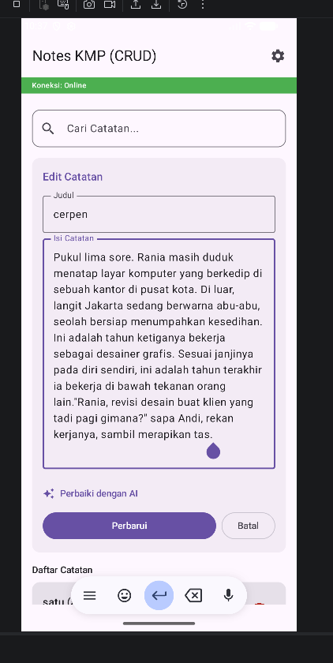
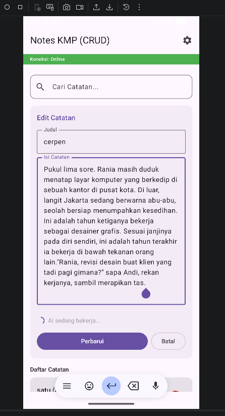
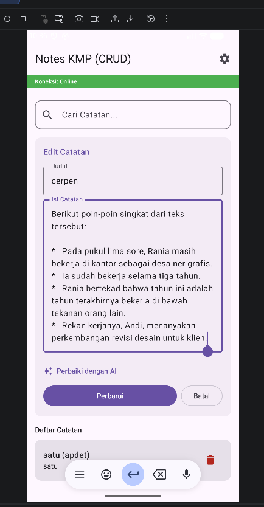

# 📝 Notes KMP - AI Integrated Assistant

Aplikasi catatan lintas platform (Kotlin Multiplatform) yang dilengkapi dengan fitur cerdas berbasis AI untuk merangkum konten catatan secara otomatis. Proyek ini merupakan bagian dari tugas praktikum pengembangan aplikasi mobile.

## 🚀 Fitur Utama
- **CRUD Catatan**: Menambah, membaca, memperbarui, dan menghapus catatan secara lokal.
- **Pencarian Cepat**: Mencari catatan berdasarkan judul atau isi.
- **AI Note Summarizer**: Fitur unggulan yang menggunakan **Google Gemini 2.5 Flash** untuk merangkum catatan panjang menjadi poin-poin singkat hanya dengan satu klik.
- **Network Awareness**: Indikator status jaringan (Online/Offline) untuk memastikan fitur AI siap digunakan.
- **Device Info**: Informasi perangkat yang ditampilkan di menu pengaturan.

## 🛠️ Teknologi yang Digunakan
- **Kotlin Multiplatform (KMP)**: Shared logic antara platform Android dan iOS.
- **Compose Multiplatform**: UI framework untuk tampilan yang konsisten.
- **SQLDelight**: Local database dengan type-safe SQL.
- **Ktor Client**: Untuk komunikasi data dengan Google Gemini API.
- **Koin**: Dependency Injection untuk manajemen service dan database.
- **Google Gemini API (Generative AI)**: Model `gemini-2.5-flash` untuk pemrosesan teks.

## 🤖 Integrasi AI
Fitur AI diimplementasikan melalui `GeminiService` yang terintegrasi dengan REST API Google. 

### Alur Kerja AI:
1. User memasukkan konten catatan pada kolom "Isi Catatan".
2. User menekan tombol **"Ringkas dengan AI"**.
3. Aplikasi mengirimkan *prompt* khusus ke server Google: `"Tolong buatkan ringkasan singkat dalam bentuk poin-poin untuk catatan ini: [isi_catatan]"`.
4. Respon JSON dari AI di-parsing menggunakan `Kotlinx Serialization`.
5. Hasil ringkasan ditampilkan kembali ke user, menggantikan atau memperkaya catatan asli.

## 📦 Cara Menjalankan
1. Clone repositori ini.
2. Dapatkan API Key dari [Google AI Studio](https://aistudio.google.com/).
3. Masukkan API Key Anda pada file `GeminiService.kt`:
   ```kotlin
   private val apiKey = "YOUR_API_KEY_HERE"

## Screenshot



